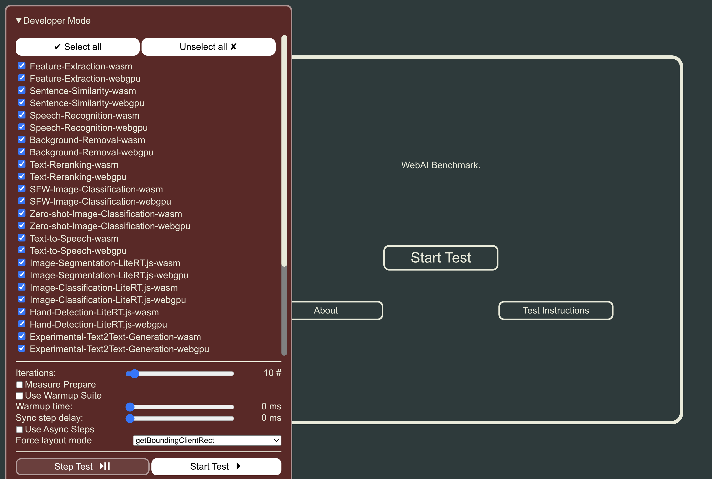

# Web AI Workloads

This repository contains interesting AI workloads running on the Web, using WebAssembly (Wasm), WebGPU, and in future WebNN or other underlying technologies.
Those workloads help us to evaluate the performance of the implementation, e.g., in browsers or JavaScript and WebAssembly runtimes.

The runner, which allows to select workloads, including ones from external sources, and collects and displays metrics, is based on the [Speedometer runner](https://github.com/WebKit/Speedometer).
See the Speedometer repo for a more detailed explanation, e.g., in which phases workloads are run and measured.

## Setup Instructions, How to Run Workloads

- Prerequisites: NPM, node. `npm install` to install the dependencies of the runner.
- Building the individual workloads: Run `npm run build` in the root directory. This will install dependencies and build all workloads in `resources/`. Alternatively, you can also manually run `npm install` and `npm run build` inside each `resources/<workload-group>/` sub-directory to produce output in `resources/<workload-group>/dist/`.
- Starting the web server: `npm run dev` in the root directory.
- Most important files:
    - Workloads are in `resources/transformers-js/` and `resources/litert-js`.
    - Shared files are in `resources/shared/`, which is depended-upon as a local package.
    - The default suite / tests to run are in `resources/default-tests.mjs`.

## How to Run Individual Workload

- If you have not done that yet, run `npm install` and `npm run build` inside `resources/<workload-group>/` to produce output in `dist/`.
- `npm run dev` in the root directory to start the server.
-  Navigate to `http://localhost:8080/resources/<workload-group>/dist/<workload>.html` (e.g. `http://localhost:8080/resources/transformers-js/dist/feature-extraction-cpu.html`) then do `manualRun()` in the developer console.

## Developer Mode and Custom Parameters

The runner supports a number of options to control how the benchmarks are run.
They can be set via URL parameters or more conveniently via the developer menu.

To enable the developer menu, append `?developerMode` to the URL, e.g. `http://localhost:8080/?developerMode`.
Then click on the red box in the top left corner to show this:

You can select workloads by tag (e.g. all `#wasm` or `#webgpu` workloads) and change parameters of the runner in it.
Changing them in the developer menu should be immediately reflected in the URL, producing e.g. `http://localhost:8080/?iterationCount=1&tags=wasm`

A full list of the runner options can be found in [params.mjs](resources/shared/params.mjs).

## Contributing

See the [CONTRIBUTING](CONTRIBUTING.md) file for how to help out.

## Source Code Headers

Every file containing source code must include copyright and license
information.
This includes any JS/CSS files that you might be serving out to
browsers.
(This is to help well-intentioned people avoid accidental copying that doesn't comply with the license.)

BSD 2-clause header:

    Copyright 2025 Google LLC

    Use of this source code is governed by a BSD-style
    license that can be found in the LICENSE file or at
    https://developers.google.com/open-source/licenses/bsd

Workloads from third party projects or files from the original Speedometer runner may have different, but compatible licenses (e.g., Apache 2).
The respective subdirectories should have the appropriate LICENSE file.
